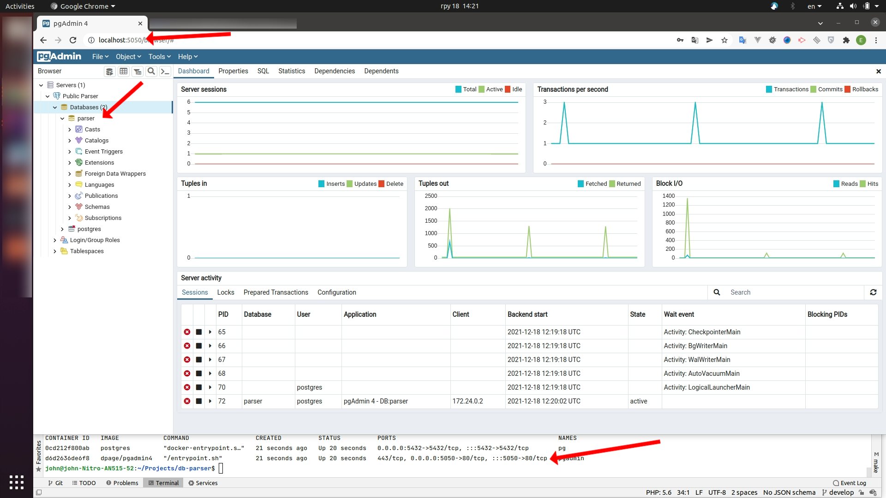
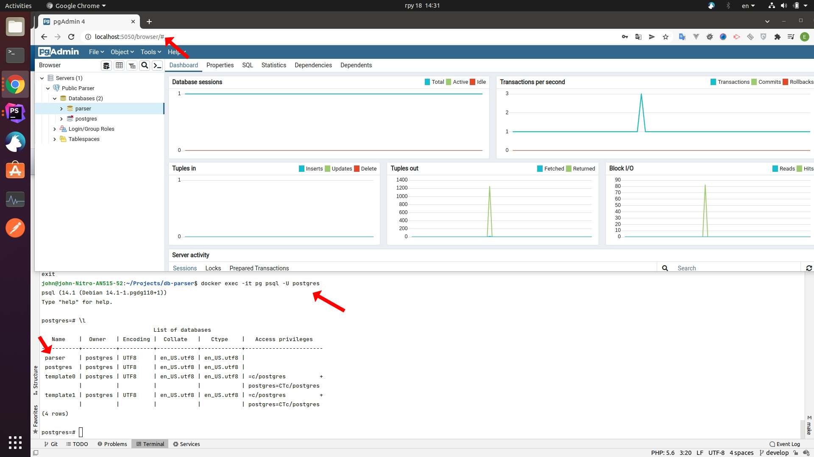

# Parser UI

`HW-1`
У меня идея такая. 
Я хочу сделать парсинг данных с возможностью настройки через UI.
К примеру я хочу добавить парсинг публичной страницы
1. я добавляю путь 
2. возможно там есть пагинация - вешаю событие на данный путь "пагинация"
3. РАспарсить данные - в этом разделе я предпологаю что я могу сощздать объект (продукты например)
4. прописать для каждого объекта настройки получения данных
5. и что-то сделать с данными (сохранить или отправить мне а апи)
6. это все делается по расписанию
7. в дальнейшем добавить получение данных через Апи

Начальные наброски структуры.
https://dbdiagram.io/embed/61aa30de8c901501c0df7f26

`HW-2`
Я немного раширил БД (схемы выше).
Добавление индексов:
1.
В моем понимании обработка вызов запросов это отдельная логика. 
Для это я б добавил индикс request_schedule_progress на колонку date_start для выбора запросов. (самый очевидный индекс)
`CREATE INDEX request_schedule_date_start ON request_schedule_progress (date_start);`
2. Такой же индекс добавить к request_logs на колонку created_at
   `CREATE INDEX request_logs_created_at ON request_logs (created_at);`
3. для Sites, Requests я бы использовал Elasticsearch

Учитыва теорию что мы прошли. Если брать теорема CAP.
Мне кажется что моя система жолжна следовать CP или AP.
Я склоняюсь больше к AP.

`HW-3`

1. cp .env.example .env
2. docker-composer up -d 
3. http://localhost:PGADMIN_PORT/
4. PgAdmin 
5. CLI 
